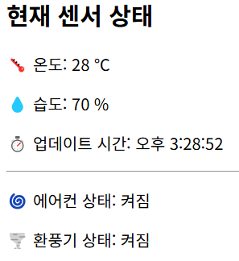

# 📡 Fitbit IoT 실시간 모니터링 시스템

**Fitbit + Raspberry Pi + MQTT + EC2 + AWS S3 + Web UI**

---

## 📁 폴더 구조

```
fitbit-iot/
├── mobile/                    # (추후 앱 개발용 디렉토리)
├── raspberrypi/              # 라즈베리파이 센서 수집 코드
│   ├── sensor_mqtt.py
│   └── config.json
├── server/
│   ├── index.js              # 서버 진입점
│   ├── .env                  # AWS 설정
│   ├── package.json
│   └── src/
│       ├── logs/             # 로그 JSON 파일 자동 생성
│       ├── mqtt/
│       │   └── receiver.js   # MQTT 수신 및 처리
│       ├── routes/
│       │   └── sensor.js     # REST API (/api/sensor)
│       ├── shared/
│       │   └── state.js      # 센서 상태 공유 객체
│       ├── utils/
│       │   └── s3Uploader.js # S3 업로드 유틸 함수
│       └── views/
│           └── index.html    # 실시간 상태 웹페이지
```

---


## 환경 설정 (.env)

```
AWS_ACCESS_KEY_ID=YOUR_ACCESS_KEY
AWS_SECRET_ACCESS_KEY=YOUR_SECRET_KEY
AWS_REGION=ap-northeast-2
S3_BUCKET=your-s3-bucket-name
```

## 📡 데이터 흐름 구조

```
[라즈베리파이]
  ↓ (MQTT publish: sensor/data)
[EC2 서버: mqtt/receiver.js]
  ↓
[shared/state.js] ← 최신 상태 저장
  ↓
[REST API: /api/sensor] → routes/sensor.js
  ↓
[웹 UI: views/index.html] ← 실시간 데이터 표시
  ↓
[로그 파일 저장: src/logs/]
  ↓
[S3 업로드: logs/YYYY-MM-DD/log_YYYY-MM-DD.json]
```

---

## 🧪 MQTT 테스트 명령어

```bash
mosquitto_pub -t sensor/data -m "{\"temperature\":28,\"humidity\":70}"
```

---

## ☁️ S3 저장 구조

- 하루에 하나의 JSON 로그 파일 (`log_YYYY-MM-DD.json`)
- S3에는 다음 구조로 업로드됨:

```
logs/
└── 2025-04-17/
    └── log_2025-04-17.json
```

---

## 📌 주요 기능 요약

| 기능                      | 설명 |
|---------------------------|------|
| ✅ 실시간 MQTT 수신       | 센서 데이터 MQTT로 수신 |
| ✅ 실시간 데이터 API 제공 | `/api/sensor` |
| ✅ 웹페이지 실시간 출력   | `index.html` |
| ✅ 로그 파일 누적 저장    | `src/logs/` |
| ✅ S3 업로드 자동화       | `utils/s3Uploader.js` |

---

## 👨‍💻 개발자

> Made with 💻 by [KimTae-hee]
