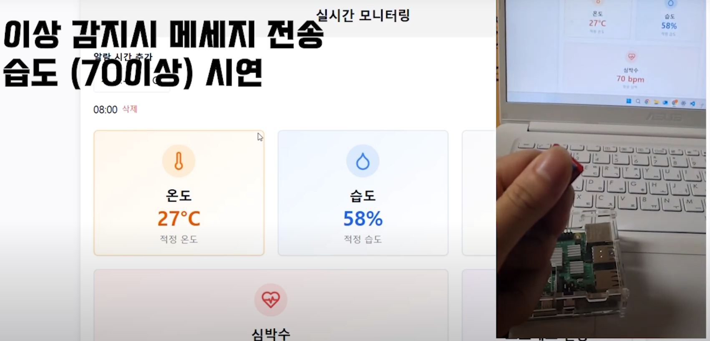
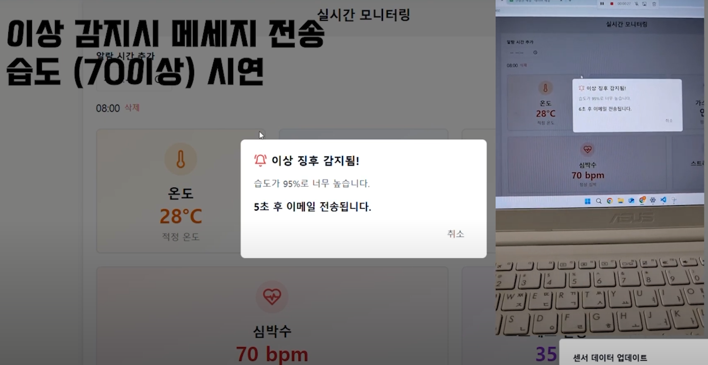
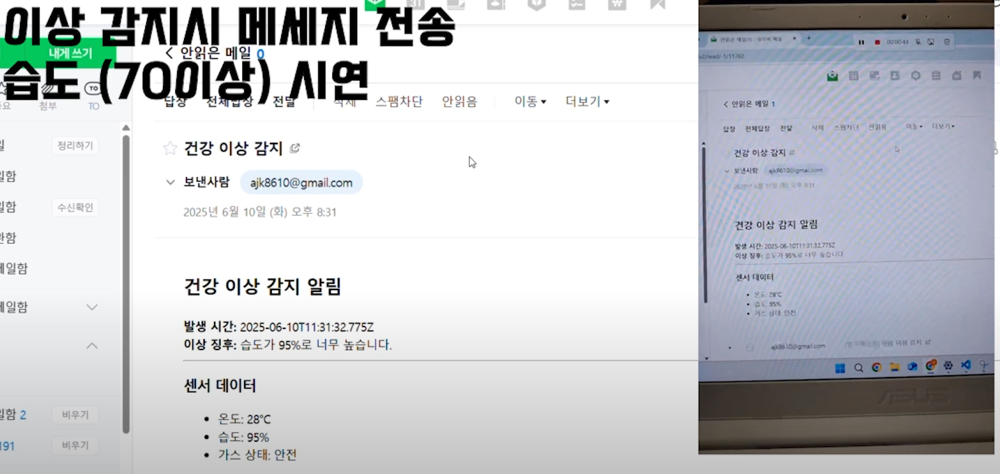

# 📡 Fitbit IoT 실시간 모니터링 시스템

**Fitbit IoT 실시간 모니터링 시스템**은 라즈베리파이 센서 데이터와 Fitbit을 연동하여  
실시간으로 클라우드(AWS) 환경에서 센서 값을 저장·분석·시각화하는 End-to-End IoT 솔루션입니다.

📎 이전 EC2/S3 기반 구현 방식은 [before.md](before.md) 파일 참고

---

## 소개

- **Fitbit + Raspberry Pi + MQTT + AWS IoT Core + AWS Lambda + DynamoDB + API Gateway + React Web UI**
- 센서 데이터를 라즈베리파이에서 MQTT로 전송 → AWS IoT Core에서 수신 및 Lambda로 처리
- Serverless 구조(AWS Lambda, API Gateway, DynamoDB)로 인프라 비용 최소화
- 웹 UI(React)에서 실시간 데이터 조회/시각화

---

## 🛠 기술 스택

| 분야         | 기술/서비스                   |
|--------------|------------------------------|
| IoT Device   | Raspberry Pi, Fitbit         |
| 데이터 전송   | MQTT, AWS IoT Core           |
| 서버리스 컴퓨팅 | AWS Lambda, API Gateway       |
| 데이터 저장   | AWS DynamoDB                 |
| 프론트엔드   | React, TypeScript, Vite      |
| 기타         | AWS IAM 등        |

---

## 주요 기능

- **라즈베리파이 ↔ IoT Core 센서 데이터 송수신(MQTT)**
- **AWS Lambda로 데이터 파싱/저장/응답 (서버리스 아키텍처)**
- **API Gateway를 통한 Web API 제공(GET/POST)**
- **React Web UI 실시간 데이터 fetch/렌더링**
- **EC2/S3 → 완전 서버리스 구조 전환, 운영비 절감**

---

## 📁 폴더 구조

```plaintext
fitbit-iot/
├── raspberrypi/
│   ├── sensor_mqtt.py        # 센서 데이터 수집 및 MQTT 전송
│   └── config.json           # 디바이스 설정
├── server/                   # (비활성) 기존 EC2/S3 코드 보관용
├── lambda/
│   ├── handler.py            # Lambda 함수 (데이터 파싱, 저장, 조회)
│   └── requirements.txt
├── src/                      # React Web UI
│   ├── api/
│   │   └── sensor.ts
│   ├── components/
│   ├── pages/
│   ├── App.tsx
│   └── index.tsx
├── package.json
├── tsconfig.json
├── vite.config.ts
```

---
## 데이터 흐름
```plaintext
[라즈베리파이]
  ↓ (MQTT Publish)
[AWS IoT Core]
  ↓ (IoT Rule)
[AWS Lambda]
  ↔ [DynamoDB] (저장/조회)
  ↓
[API Gateway]
  ↓
[React Web UI] (fetchSensorData)
```

---

## ✅ 구현 기능 현황

- [x] 라즈베리파이 센서 MQTT 전송
- [x] AWS IoT Core 연결 및 IoT Rule 설정
- [x] Lambda에서 데이터 파싱/저장/조회
- [x] DynamoDB 연동
- [x] API Gateway + Lambda Proxy 통합
- [x] React Web UI 실시간 데이터 렌더링
- [x] EC2/S3 환경 제거, 완전 서버리스 전환

---

## 스크린샷

<p align="center">
  
  
  
</p>

---

## 배운 점 & 느낀 점

- **MQTT와 IoT Core 연동**을 통해 IoT 실시간 메시지 구조 이해
- **AWS Lambda/Serverless 아키텍처**로 무중단 운영, 비용절감 실습
- **React + API Gateway 연동**으로 프론트-백엔드 API 설계 및 최적화 경험
- **DynamoDB NoSQL 모델링** 경험 및 쿼리 성능 개선 실습

---

## 👨‍💻 개발자

> Made with 💻 by [KimTae-hee]


